# MYFI — خطة تنفيذ الهوية البصرية الجديدة

**الحالة:** معتمدة من مالك المنتج · **التاريخ:** 2026-08-28
**الهدف:** تحويل معاينات MYFI المعتمدة إلى واجهات حقيقية متماسكة في التطبيق، على مراحل صغيرة وآمنة، من دون تعطيل منطق المال أو تغيير البيانات أو رفع أي تغييرات إلى GitHub قبل طلب صريح.

## 1. القرار المعتمد

هذه ليست إعادة تلوين للشاشات، بل نظام تجربة واحد:

- **الهدوء قبل الزحمة:** الشاشة تجيب سؤالًا واحدًا أو عددًا قليلًا من الأسئلة الواضحة؛ لا تجمع تقريرًا وقائمة إعدادات ولوحة متابعة في المكان نفسه.
- **العنوان خارج البطاقة:** عنوان الصفحة أو القسم يعرّف المقصود، والبطاقة تحتوي البيانات أو الفعل فقط.
- **بطاقات ذات وظيفة:** لا تُنشأ بطاقة لمجرد العرض. كل بطاقة يجب أن تفتح تفصيلًا، تسجّل عملية، أو تساعد المستخدم على قرار.
- **تدرّج من البسيط إلى المتقدم:** الملخص اليومي ظاهر فورًا؛ التحليل والمقارنة والتخصيص في مكان مستقل لمن يحتاجها.
- **الألوان دلالية لا زخرفية:** أخضر للدخل/التقدم/الفعل الإيجابي، مرجاني هادئ للمصروف أو المبلغ المستحق، كهرماني للموعد القريب أو التنبيه. لا تضاف ألوان لمجرد التنويع.
- **المخطط يجيب سؤالًا:** لا يوضع مخطط إلا إذا كان يوضح توزيعًا أو تغيرًا أو مقارنة لا يكفي النص وحده لشرحها.
- **RTL من البداية:** محاذاة، أسهم، ترتيب أيقونات، أرقام وتواريخ عربية/إنكليزية تتبع لغة التطبيق واتجاهه.
- **الثيم جزء من العقد:** البنية نفسها في الداكن والفاتح؛ الفرق في الخلفيات والحدود والتباين، لا في ترتيب المعلومات أو سلوكها.

### قواعد الشكل

| العنصر | القاعدة |
|---|---|
| الخلفية | داكن: فحمي عميق. فاتح: عاجي/أبيض دافئ، لا أبيض مزرق قاسٍ. |
| البطاقات | حدود دقيقة، نصف قطر متسق، ظل خفيف في الفاتح وعمق محدود في الداكن. |
| النص | عنوان قوي، وصف قصير، وقيمة مالية مقروءة؛ لا نصوص صغيرة متراكمة. |
| الأيقونات | خطية وواضحة ضمن مربع أو دائرة ناعمة؛ لا خلط أساليب الأيقونات. |
| التفاعل | الصف القابل للنقر يملك سهمًا واتجاهًا واضحًا؛ الزر يصف نتيجته الفعلية. |
| الحركة | فتح/طي قصير وهادئ؛ لا رسوم تسترعي الانتباه على حساب القراءة. |

## 2. هيكل المنتج بعد التنفيذ

```text
الرئيسية
├─ الرصيد المتاح + ملخص الشهر
├─ إضافة سريعة
├─ محافظ مختصرة (عند الحاجة فقط)
└─ حالات مهمة قابلة للطي

أموالي
├─ الحركات والسجل
├─ الخطة والميزانية
└─ التقارير

المتابعات
├─ ديون ومستحقات
├─ أقساط
├─ التزامات
├─ اشتراكات
└─ أهداف وتوفير

المزيد
├─ أدواتي: توزيع الدخل، التصنيفات، الأرشيف
├─ البيانات والملفات
├─ المزايا: بصيرة MYFI والمكافآت
└─ المساعدة وإعدادات التطبيق
```

المحافظ ليست بوابة كبيرة في «أموالي». تظهر باختصار في الرئيسية عندما تخدم اختيار مصدر المال، وتُختار داخل تسجيل الحركة. إدارتها منخفضة التكرار تقع في «المزيد» عند اكتمال وظائف الإضافة/إعادة التسمية/الأرشفة/الافتراضية.

## 3. التقارير: العقد المعتمد

### التقرير العادي — متاح للجميع

1. فترة التقرير، ومعها فلتر المحافظ عند وجود أكثر من محفظة.
2. دخل + مصروف + صافي الشهر.
3. أين ذهب المال: أعلى التصنيفات مع انتقال إلى الحركات المطابقة.
4. مقارنة قصيرة يختار المستخدم مرجعها.
5. الخطة مقابل الواقع إذا حفظ المستخدم خطة توزيع دخل.
6. مدخل واحد إلى «بصيرة MYFI».

لا تتحول هذه الصفحة إلى تبويبات كثيرة أو أدوات مقارنة معقدة.

### بصيرة MYFI — التحليل المتقدم

اسم المنتج المعتمد: **بصيرة MYFI**.

- **استوديو مقارنة حر:** المستخدم يختار أي أشهر أو سنوات أو نطاق تاريخ مخصص، ويضيف ويحذف الفترات بحرية؛ لا تُفرض مقارنة الشهر السابق أو فترتان ثابتتان.
- **اتجاهات قابلة للتفسير:** دخل، مصروف، ادخار أو تصنيف عبر الزمن، مع انتقال من النقطة أو التصنيف إلى الحركات.
- **لماذا تغيّر؟** كل استنتاج يعرض الدليل والحركات التي أسسته؛ مثال: «المطاعم أعلى 25% بسبب 8 حركات إضافية».
- **الالتزامات والاشتراكات:** الكلفة المتكررة، ما القادم، والمسار إلى متابعة العنصر.
- **توقع نهاية الشهر:** تقدير مشروط بالنمط الحالي وبالالتزامات المسجلة، مع عرض الافتراضات وعبارة واضحة أنه تقدير لا حقيقة مؤكدة.
- **PDF مخصص:** المستخدم يحدد الأقسام والفترات قبل الحفظ أو المشاركة.

الذكاء يبدأ من التحليل المحلي المثبت في التطبيق. لا يُعرض أي ادعاء «AI» فارغ. إذا أضيف نموذج خارجي لاحقًا، يلزم: موافقة صريحة قبل إرسال بيانات، توضيح البيانات المرسلة، وإخلاء مسؤولية ثابت بأنه مساعدة تحليلية وليس نصيحة استثمارية.

### خطة توزيع الدخل

المكان: **المزيد ← أدواتي ← توزيع الدخل**.

- نقطة البداية اختيارية: 50/30/20، سداد ديون أولًا، ادخار أولًا، أو خطة مخصصة.
- المبالغ مبنية على الدخل الصافي الذي يؤكده المستخدم، لا على تخمين غير معلن.
- المستخدم يضبط: أساسيات، مصاريف مرنة، ادخار/أهداف، سداد ديون، ومبلغ مخصص للاستثمار.
- الحفظ ينشئ أثرًا حقيقيًا: أهداف ميزانية/خطة تُقارن مع الواقع داخل التقرير العادي.
- «استثمار مخصص» مبلغ تخطيط فقط، وليس توصية استثمارية أو توقع عائد.

قاعدة 50/30/20 تعرض كبداية تعليمية وليست قاعدة إلزامية؛ المصدر المرجعي: [CFPB](https://files.consumerfinance.gov/f/documents/cfpb_building_block_activities_analyzing-budgets_worksheet.pdf) و[مناقشة حدود القاعدة](https://www.ynab.com/blog/how-much-of-my-paycheck-should-i-save).

## 4. مراحل التنفيذ

### المرحلة 0 — تثبيت العقد البصري والبيانات

**الهدف:** تأكيد هذه الخطة، المراجع، العقود المالية، واختبارات الأساس قبل تغييرات الواجهة.
**لا تغيير سلوكي:** لا نقل/حذف بيانات، لا إعادة تسمية حقول مالية، لا تغيير مزامنة أو مصادقة.
**الحالة:** مكتملة — هذا الملف ومجلد المعاينات هما المرجع البصري المضافان.

### المرحلة 1 — الرئيسية (مسؤول Codex · مكتملة محليًا)

**نطاق الملفات المتوقع:** `src/screens/HomeScreen.js` ومكوّنات العرض المرتبطة واختبارات الواجهة فقط.

- تراتبية: تحية → الرصيد المتاح → ملخص الشهر → إضافة سريعة → محافظ مختصرة → حالات قابلة للطي.
- لا فلتر «هذا العام» في الرصيد المتاح.
- لا تنبيه افتتاحي مزعج أسفل المحافظ.
- المحافظ تتكيف: واحدة عريضة، اثنتان متساويتان، وثلاث أو أكثر تمرير أفقي؛ لا فراغ كبير.
- الضغط على المحفظة يضبط الافتراضية مباشرة بحسب السلوك المعتمد، ولا يعيد نافذة قائمة المحافظ القديمة.
- الأقسام المهمة/التوفير/آخر الحركات تحافظ على منطق الطي والحركات الموجودة.

**معيار القبول:** لقطتا داكن/فاتح، RTL صحيح، عدم تكرار البيانات، وكل زر موجود يؤدي إلى أثر فعلي.

### المرحلة 2 — أموالي (مسؤول Codex · مكتملة محليًا)

**النطاق:** `MyMoneyScreen` ومداخل التنقل المباشرة فقط.

- ثلاث بوابات فقط: الحركات والسجل، الخطة والميزانية، التقارير.
- لا رصيد مكرر، ولا بطاقة محافظ رئيسية بلا وظيفة.
- اختصارات قليلة، ولا يظهر «توزيع الدخل» كاختصار إلا بعد أن يصبح مساره فعليًا في المرحلة 5.

**معيار القبول:** كل بطاقة تقود لمسار موجود، ولا توجد بطاقة عرض بلا وظيفة.

### المرحلة 3 — المتابعات ومساراتها (مسؤول Codex · قيد الإكمال محليًا)

**النطاق:** بوابة المتابعات وشاشات الديون/المستحقات، الأقساط، الالتزامات، الاشتراكات، والأهداف/التوفير، بدون لمس منطق المبالغ أو مواعيدها.

- البوابة تعرض ما يحتاج انتباهًا ثم مداخل متخصصة، لا لوحة عدادات مزدحمة.
- لكل نوع صفحة متخصصة وسلوك واضح: تسجيل دفع، تسجيل استلام، إضافة للتوفير، إيقاف/تعديل اشتراك، أو فتح سجل الدفعات.
- الالتزامات والاشتراكات منفصلتان؛ لا يعاد دمجهما في شاشة واحدة.

**معيار القبول:** موعد/مبلغ/تقدم وفعل واحد واضح لكل بطاقة، مع حالات فارغة مفهومة.

### المرحلة 4 — التقارير وبصيرة MYFI (مسؤول Codex · قيد الإكمال محليًا)

**النطاق:** `ReportsScreen` وعقود العرض/التصدير المتعلقة به فقط.

- إعادة بناء التقرير العادي وفق §3.
- نقل المقارنة الحرة والاتجاهات والتفصيل وPDF إلى «بصيرة MYFI».
- لا حاجز اشتراك مزيف قبل وجود نظام استحقاق حقيقي؛ يمكن تقديم الواجهة كـ«تحليل متقدم» أثناء التطوير.
- لا صافي ثروة أو توصية استثمارية قبل وجود نموذج مالي حقيقي لها.

**معيار القبول:** لا مخطط بلا سؤال، كل معلومة يمكن التحقق منها من الحركات، والتوقع يذكر افتراضه.

### المرحلة 5 — المزيد والإعدادات وخطة توزيع الدخل (مسؤول Codex · قيد الإكمال محليًا)

**النطاق:** `MoreScreen`، مسارات الإعدادات، وأداة خطة الدخل وبياناتها/اختباراتها فقط.

- «المزيد» مركز تنقل منظم؛ لا مفاتيح تشغيل داخل الصفحة الأم.
- الإعدادات مقسمة: المظهر واللغة، التجربة والتخصيص، الخصوصية والأمان، البيانات والنسخ الاحتياطي، المساعدة.
- كل إعداد معروض يجب أن يغير سلوكًا أو واجهة فعلية.
- خطة توزيع الدخل تحفظ نسبًا صالحة مجموعها 100%، وتحولها إلى مبالغ، وتظهر نتيجتها لاحقًا في التقرير.

**معيار القبول:** لا إعداد وهمي؛ التخطيط محفوظ ومقاس مقابل الواقع، والمسارات قابلة للوصول من «المزيد».

### المرحلة 6 — الدمج والتحقق

- مراجعة RTL والداكن/الفاتح على كل شاشة.
- تدقيق الوصول: الدور، الاسم، الحالة المحددة، وحجم اللمس.
- تدقيق الفراغات على المقاسات الصغيرة والكبيرة.
- اختبارات وحدة/واجهة، فحص صياغة، بوابة الاختبارات الثابتة، ومراجعة يدوية لمسار: إضافة حركة → محفظة → تقرير → متابعة → إعداد.
- لا رفع/دفع/دمج إلى GitHub إلا بأمر صريح من مالك المنتج.

## 5. ملكية التنفيذ الحالية

Codex مسؤول الآن عن جميع مراحل الهوية البصرية والتنفيذ؛ لا يوجد عمل متوازٍ فعّال مع Claude.

1. تراجع كل مسودة أو تغيير سابق مقابل هذا العقد والمعاينات قبل اعتماده.
2. لا يُحذف منطق مالي، ولا تتغير بيانات المستخدم أو المزامنة أو المصادقة لمجرد تغيير بصري.
3. كل مدخل أو إعداد أو زر يجب أن يصل إلى سلوك حقيقي؛ لا واجهات تسويقية أو أزرار ميتة.
4. عند ظهور اعتماد بين مرحلتين، مثل خطة توزيع الدخل والتقرير، يبنى عقد بيانات صغير محفوظ ومختبر قبل عرضه للمستخدم.
5. تسلّم كل دفعة محليًا مع اختباراتها وحالات التحقق الداكنة والفاتحة. لا رفع أو دفع إلى GitHub إلا بطلب صريح من مالك المنتج.

## 6. برومبت جاهز لكلاود

> أنت تعمل بالتوازي مع Codex على مشروع MYFI. اقرأ كاملًا أولًا: `docs/design/00_README_DESIGN_SOURCE_OF_TRUTH.md`، `docs/design/02_MYFI_VISUAL_IDENTITY_CANONICAL.md`، `docs/design/07_MYFI_SCREEN_DESIGN_SPECIFICATIONS.md`، وهذا الملف `docs/design/15_MYFI_VISUAL_ROLLOUT_IMPLEMENTATION_PLAN.md`. راجع كذلك الصور المرجعية في `docs/design/assets/visual-rollout-2026-08-28/` قبل أي كود.
>
> اختر مرحلة واحدة فقط من 2 إلى 5، مختلفة عن المرحلة 1 التي يملكها Codex، واذكر في البداية: «أملك المرحلة X والملفات Y». أوصيك بالمرحلة 3 (المتابعات ومساراتها) لأنها لا تتداخل مع `HomeScreen`. لا تغيّر المرحلة 1، ولا تعدّل الملفات خارج نطاق مرحلتك إلا بعد التنسيق.
>
> طبّق الهوية المعتمدة: عنوان خارج البطاقة، بطاقات ذات وظيفة، هدوء بصري، ألوان دلالية فقط، RTL حقيقي، داكن وفاتح بنفس البنية، ولا مخطط بلا سؤال. طابق التسلسل والقرارات مع الصور، لا تفاصيل البكسل حرفيًا.
>
> لا تحذف أو تغيّر منطق المال، الأرصدة، الديون، المواعيد، المزامنة، المصادقة، أو مخطط البيانات. لا تنشئ أزرارًا أو إعدادات بلا أثر. لا تضف نموذج ذكاء خارجي أو ادعاء AI بلا موافقة/خصوصية/دليل. لا ترفع أو تدفع أو تدمج إلى GitHub؛ كل العمل محلي. استخدم تعديلات صغيرة قابلة للمراجعة، واختبر بعد التعديل. عند الانتهاء سلّم: ملخصًا، قائمة الملفات، الاختبارات والنتائج، صور/حالات تحقق داكن وفاتح، وأي تبعية تحتاج مرحلة أخرى.

## 7. معرض المعاينات المعتمد

هذه معاينات اتجاه بصري، وليست أصولًا مستخدمة مباشرة في واجهة التطبيق. الصورة `09` استكشاف مبكر يجمع الالتزامات والاشتراكات؛ الصور `12` و`13` هما المرجع النهائي لأنهما تفصلان الصفحتين.

### التقارير والتخطيط

| التقرير العادي | بصيرة MYFI | توزيع الدخل |
|---|---|---|
| 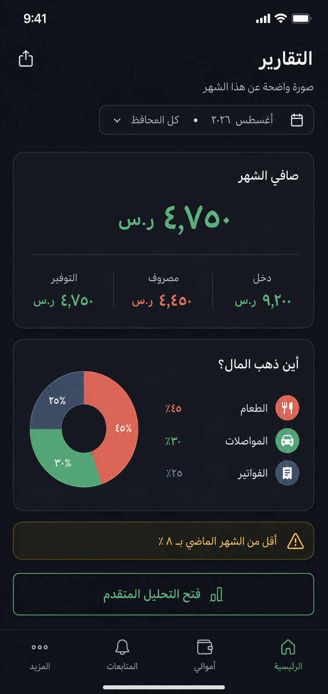 | 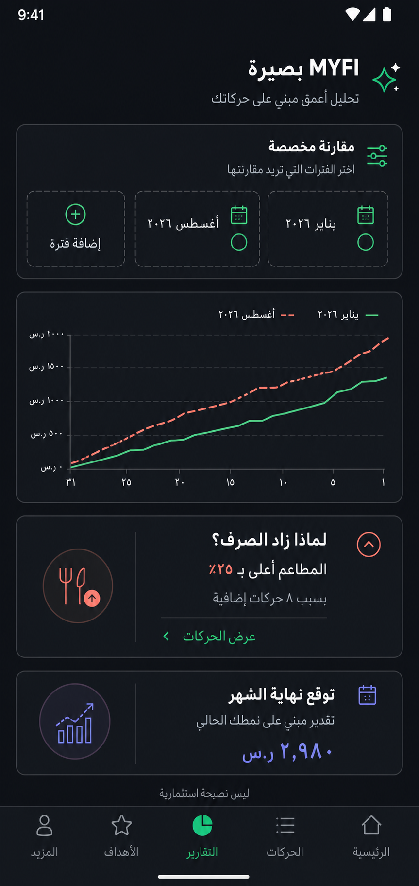 | 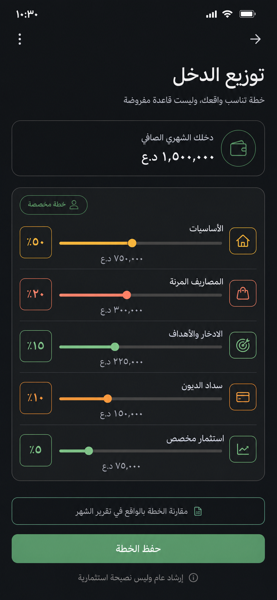 |

### الرئيسية وأموالي

| الرئيسية — داكن | أموالي — داكن |
|---|---|
| 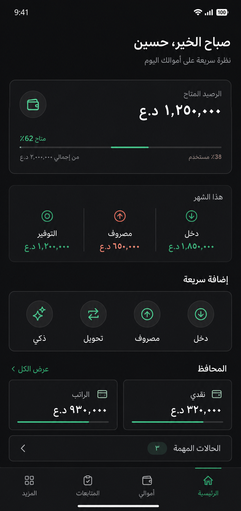 | 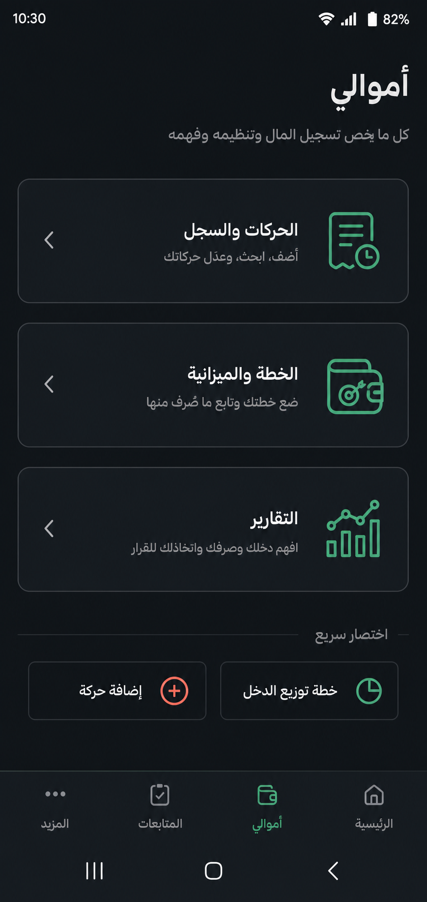 |

| الرئيسية — فاتح | أموالي — فاتح |
|---|---|
| 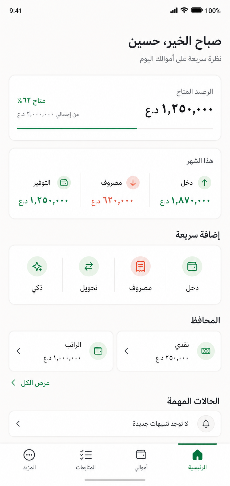 | 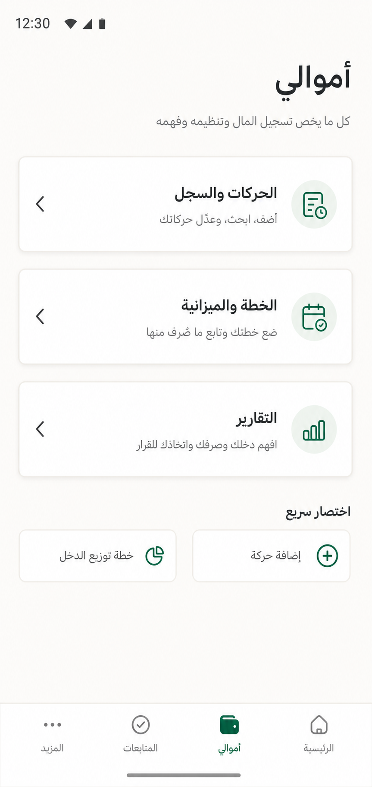 |

### المتابعات

| بوابة المتابعات | ديون ومستحقات | الأقساط |
|---|---|---|
| 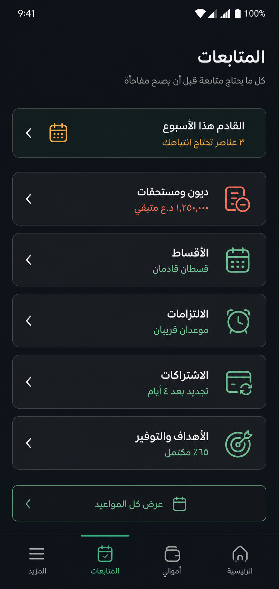 | 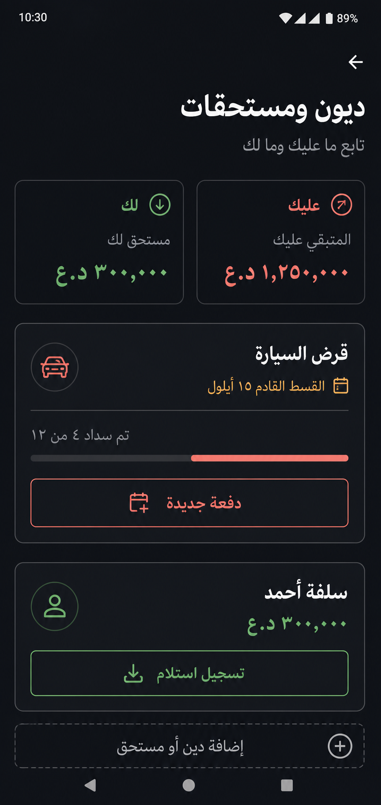 | 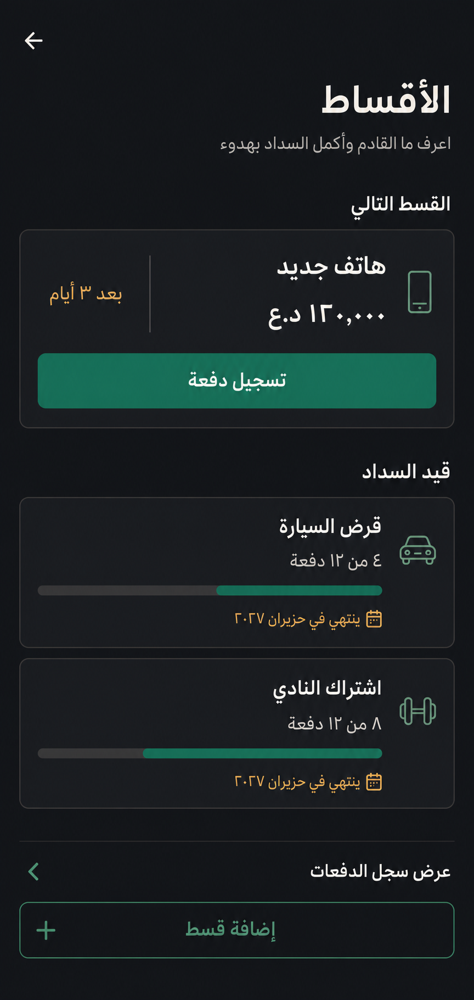 |

| استكشاف مبكر: التزامات + اشتراكات | الأهداف والتوفير | الالتزامات |
|---|---|---|
| 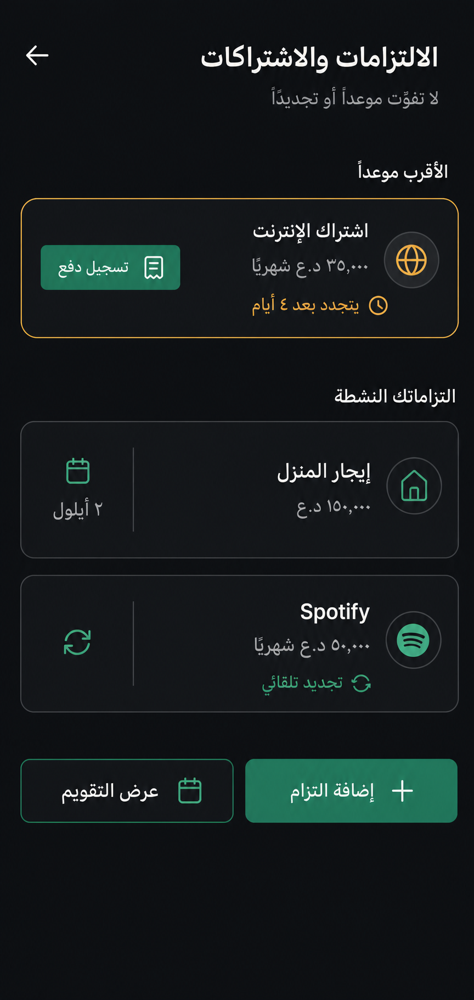 | 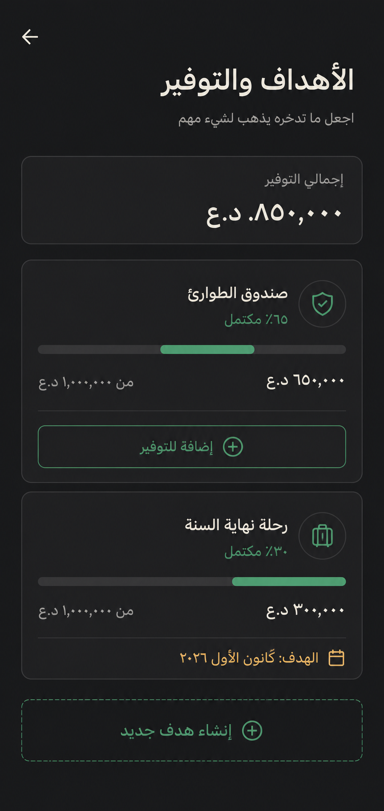 | 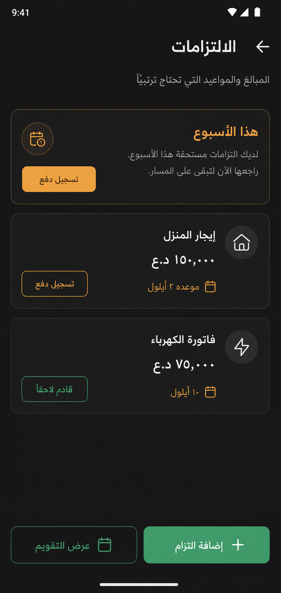 |

| الاشتراكات |
|---|
| 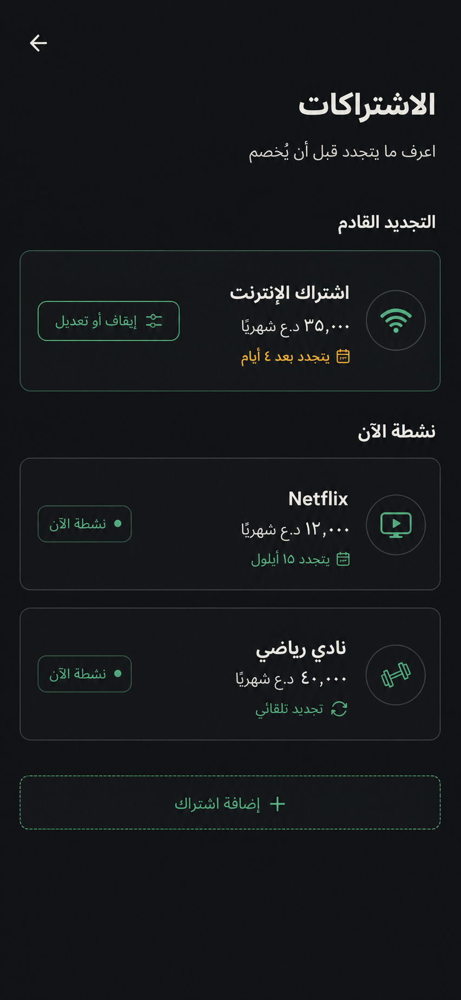 |

### المزيد والإعدادات

| المزيد | الإعدادات |
|---|---|
| 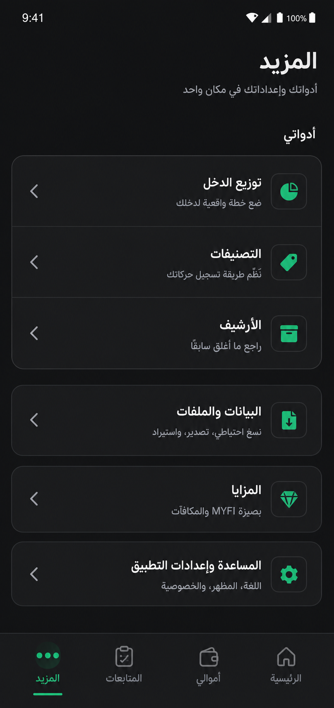 | 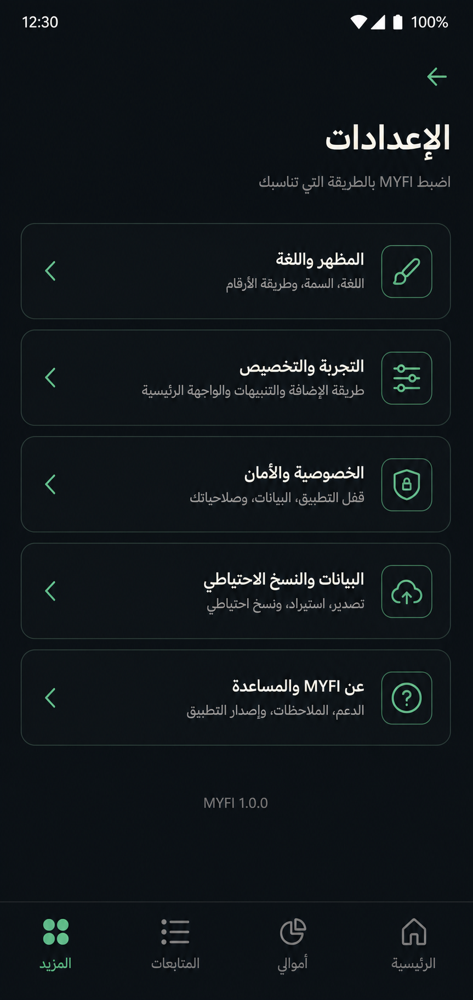 |

## 8. المصادر القانونية داخل المشروع

- `docs/design/00_README_DESIGN_SOURCE_OF_TRUTH.md`
- `docs/design/01_MYFI_MASTER_PRODUCT_DESIGN_BLUEPRINT.md`
- `docs/design/02_MYFI_VISUAL_IDENTITY_CANONICAL.md`
- `docs/design/06_MYFI_NAVIGATION_AND_INFORMATION_ARCHITECTURE.md`
- `docs/design/07_MYFI_SCREEN_DESIGN_SPECIFICATIONS.md`
- `docs/design/09_MYFI_ACCESSIBILITY_RTL_AND_RESPONSIVE.md`
- `docs/design/10_MYFI_CHART_AND_FINANCIAL_VISUALIZATION_SYSTEM.md`

عند تعارض وثيقة قديمة مع قرار صريح في هذه الخطة، يكون القرار المعتمد في هذه الخطة هو المرجع لتنفيذ جولة الهوية البصرية الحالية.
